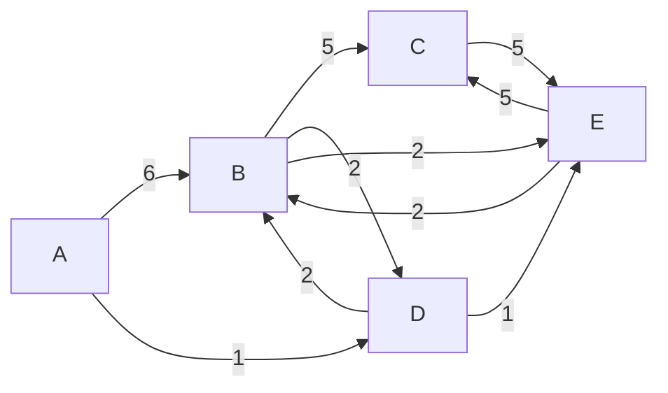

# Dijkstra's algorithm

Dijkstra's algorithm is an algorithm for finding the shortest paths between nodes in a weighted graph, which may represent, for example, road networks. It was conceived by computer scientist Edsger W. Dijkstra in 1956 and published three years later.

This function accecepts a graph with starting node and returns a `Map` containing shortest paths from the starting node to all other nodes.

## Example

Sample weighted graph:

The shortest paths from `A` to the other nodes are:

- `A` (itself): `["A"]`
- `B`: `["A", "D", "B"]`
- `C`: `["A", "D", "E", "C"]`
- `D`: `["A", "D"]`
- `E`: `["A", "D", "E"]`
