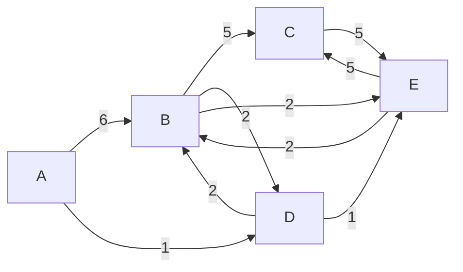

# Dijkstra's algorithm

Dijkstra's algorithm is an algorithm for finding the shortest paths between nodes in a weighted graph, which may represent, for example, road networks. It was conceived by computer scientist Edsger W. Dijkstra in 1956 and published three years later.

This function returns the nodes in the order they were visited as an array.

## Example

Sample weighted graph:

The shortest path to `E` is: `["A", "D", "E"]`
