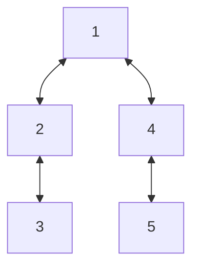
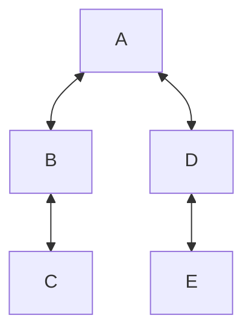

# Breadth-First Search

Breadth-First Search (BFS) is a strategy for searching in a graph that priotitizes _breadth_.

BFS begins at a root node and inspects all the neighboring nodes. Then for each of those neighbor nodes in turn, it inspects their neighbor nodes which were unvisited, and so on. This function returns the nodes in the order they were visited as an array.

## Usage

```typescript
import { breadthFirstSearch } from "functional-algos";

const graph = new Map<string, string[]>([
  ["A", ["B", "D"]],
  ["B", ["A", "C"]],
  ["C", ["B"]],
  ["D", ["A", "E"]],
  ["E", ["D"]],
]);

const result = breadthFirstSearch(graph, "A");
```

## Examples

_Also used in the tests_

Using a graph consisting of numbers:



Returns `[1, 2, 4, 3, 5]`

Using a graph consisting of strings:



Returns `["A", "B", "D", "C", "E"]`
