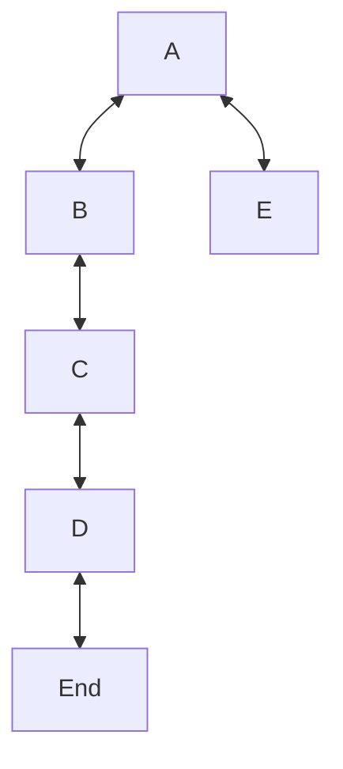

# Depth-First Search

Depth-First Search (DFS) is a strategy for searching in a graph that priotitizes _depth_.

The algorithm starts at the root node and explores as far as possible along each branch before backtracking. This means it goes deep into a branch and then backtracks when it can go no further. This function returns the nodes in the order they were visited as an array.

## Examples

_Also used in the tests_

Using a graph consisting of numbers:

Returns `[1, 2, 3, 4, 5]`

Using a graph consisting of strings:

Returns `["A", "B", "C", "D", "E"]`
